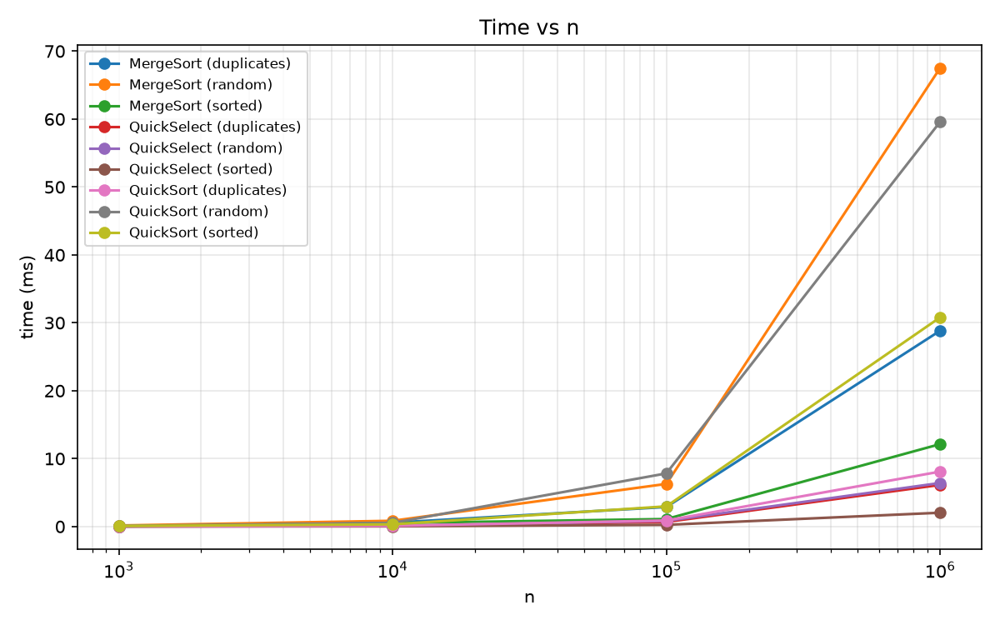
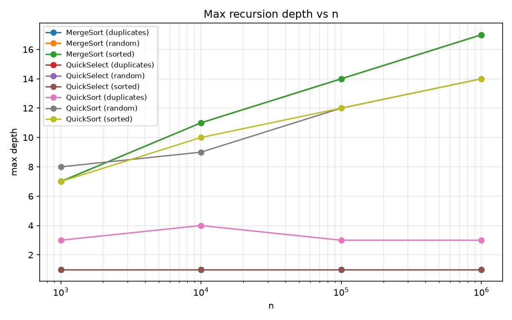
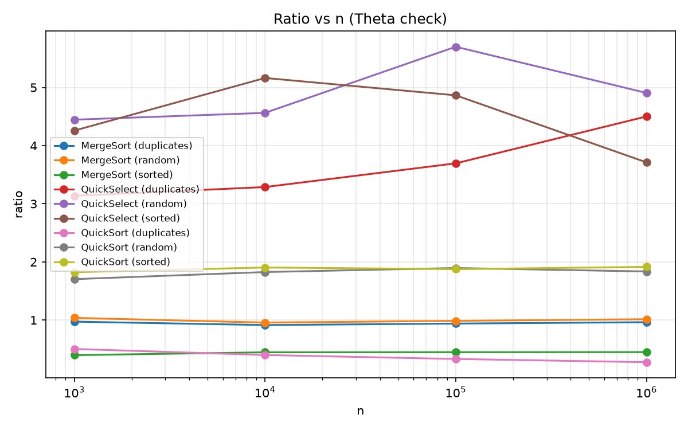

# Report — Fast Sorting & Selection Engine

## 1. Asymptotic Bounds

| Algorithm | Best case | Average case | Worst case | Reason |
|---|---|---|---|---|
| Insertion Sort | Θ(n) | Θ(n²) | Θ(n²) | Best: already sorted, one comparison per element. Worst: reverse sorted, shifts every element. |
| MergeSort | Θ(n log n) | Θ(n log n) | Θ(n log n) | Always splits in half and merges in O(n), independent of input order. |
| QuickSort | Θ(n log n) | Θ(n log n) | O(n²), but Θ(n log n) expected with random pivot | Worst case only if pivot repeatedly hits smallest/largest element — astronomically unlikely with a random pivot. |
| QuickSelect | Θ(n) | Θ(n) | O(n²), but Θ(n) expected with random pivot | Each partition is O(current size), recursion continues on only one side. |

## 2. Recurrences and Master Theorem

**MergeSort:** T(n) = 2T(n/2) + Θ(n) → a=2, b=2, f(n)=Θ(n) → n^(log_b a) = n. Same order as f(n) → **Case 2** → Θ(n log n).

**QuickSort** (balanced split assumption): T(n) = 2T(n/2) + Θ(n) → same as MergeSort → **Case 2** → Θ(n log n).

Why random pivot gives O(n log n) on average: a random pivot is unlikely to repeatedly land near the extremes of the subarray. Even a consistent 25/75 split still yields Θ(n log n); the probability of hitting true O(n²) behavior shrinks exponentially with n, so the expected cost over the pivot's randomness is Θ(n log n).

**QuickSelect** (balanced split assumption): T(n) = T(n/2) + Θ(n) → a=1, b=2, f(n)=Θ(n) → n^(log_b a) = n^0 = 1, f(n) grows polynomially faster → **Case 3** → Θ(n).

This is the different Master Theorem case mentioned in the assignment: QuickSelect recurses into only *one* side (a=1) instead of two (a=2), so the Θ(n) work at the top level dominates the sum of all recursive levels below it, bringing the total down from Θ(n log n) to Θ(n).

## 3. Plots

## 4. Θ Check

Ratio = comparisons / (n·log2 n) for MergeSort/QuickSort, comparisons / n for QuickSelect:

| n | MergeSort random | MergeSort sorted | MergeSort dup | QuickSort random | QuickSort sorted | QuickSort dup | QuickSelect random | QuickSelect sorted | QuickSelect dup |
|---|---|---|---|---|---|---|---|---|---|
| 1 000 | 1.038 | 0.397 | 0.973 | 1.704 | 1.823 | 0.504 | 4.45 | 4.26 | 3.14 |
| 10 000 | 0.957 | 0.446 | 0.915 | 1.826 | 1.904 | 0.400 | 4.56 | 5.16 | 3.29 |
| 100 000 | 0.987 | 0.448 | 0.940 | 1.895 | 1.875 | 0.331 | 5.70 | 4.87 | 3.70 |
| 1 000 000 | 1.015 | 0.449 | 0.964 | 1.836 | 1.915 | 0.276 | 4.91 | 3.71 | 4.50 |

- **MergeSort**: ratio is essentially flat for every input type (random ≈ 1.0, sorted ≈ 0.45, duplicates ≈ 0.95), confirming Θ(n log n) with c1 ≈ 0.4, c2 ≈ 1.05, n0 ≈ 1 000.
- **QuickSort random/sorted**: ratio stays flat around 1.8–1.9 for both, showing the random pivot successfully prevents degradation on sorted input — strong confirmation of Θ(n log n) with c1 ≈ 1.7, c2 ≈ 1.95, n0 ≈ 1 000.
- **QuickSort duplicates**: ratio decreases as n grows (0.50 → 0.28) because the 3-way partition skips the "= pivot" region entirely, so more duplicates means proportionally fewer real comparisons at large n — still bounded, consistent with the 3-way partition design goal.
- **QuickSelect**: ratio stays in a narrow band (≈3–5.7) across all input types and n, confirming Θ(n), c1 ≈ 3, c2 ≈ 5.7, n0 ≈ 1 000.

## 5. Discussion

The results match the theoretical bounds well. QuickSelect's ratio stays flat (≈3–5.7) confirming Θ(n), and it runs 5–15× faster than the sorts at n = 1 000 000. MergeSort's ratio is constant across all input types (≈1.0 random, ≈0.45 sorted, ≈0.95 duplicates), confirming Θ(n log n) regardless of order. QuickSort's ratio stays flat for both random (≈1.8) and sorted (≈1.9) input, showing the random pivot successfully prevents the sorted-input degradation that plain QuickSort would suffer.

The main anomaly is in wall-clock time rather than comparisons: MergeSort and QuickSort run noticeably slower on "random" input than "sorted"/"duplicates" at n = 100 000–1 000 000 (e.g. MergeSort: 67.5ms vs 12.1ms), even though comparison counts don't diverge nearly as much. Since "random" is benchmarked first for each n, this is most likely JVM warm-up (JIT/class-loading cost) plus GC pauses on the large arrays, not a real algorithmic difference.

QuickSort on duplicates shows a genuine algorithmic effect: its recursion depth stays flat at 3–4 across all n (vs ~14 for random/sorted), and its ratio drops as n grows — direct evidence that the 3-way partition correctly skips the "= pivot" region and avoids extra recursion on repeated values.
